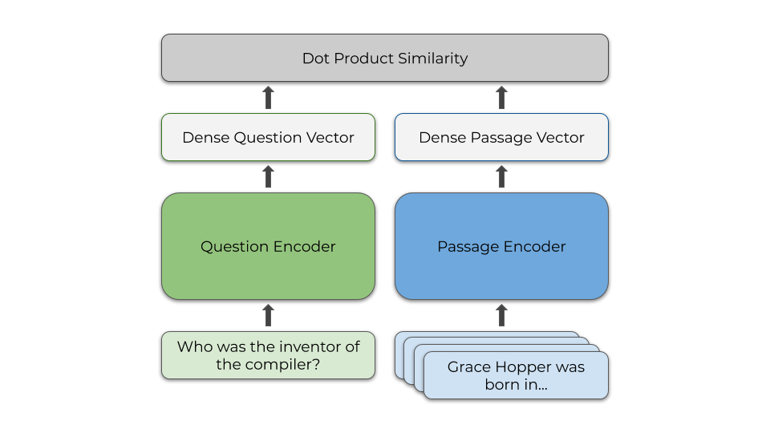

# Simple DPR



[Dense Passage Retrieval (DPR)](https://arxiv.org/abs/2004.04906) retrieves relevant documents to answer questions correctly. This repository contains a simple implementation of DPR algorithm. A query encoder and a document encoder model are trained together on a dataset containing queries, and positive and negative Wikipedia documents. Each document is a 100-word passage from a Wikipedia page. The models are trained to maximize the dot product between corresponding query and document embedding. The whole wikipedia documents or relevant documents are converted into Numpy embedding vectors. When performing a query, related documents are retrieved with FAISS index. The document embeddings are added to FAISS index and top k documents for each query is retrieved. 

### Table of Contents

1. Dataset Preparation
2. Query and Doc Encoder
3. Training and Validation
4. Testing
5. Result

### 1 Dataset Preparation

Run the following to download the dataset. Downloading wikipedia documents is not necessary for running the code.

```sh
# Download data
# Wiki pages compressed size 4.4 GB, uncompressed size 13G 
python utils/download_data.py --resource data.wikipedia_split.psgs_w100

# About 100MB
python utils/download_data.py --resource data.retriever.curatedtrec-train
python utils/download_data.py --resource data.retriever.curatedtrec-dev
python utils/download_data.py --resource data.retriever.qas.curatedtrec-test
```

Rows from `wiki.tsv`. Has about 21M 100-word segments. 
```
id      text    title
1       "Aaron Aaron ( or ; ""Ahärôn"") is a prophet, high priest, and the brother of Moses in the Abrahamic religions. Knowledge of Aaron, along with his brother Moses, comes exclusively from religious texts, such as the Bible and Quran. The Hebrew Bible relates that, unlike Moses, who grew up in the Egyptian royal court, Aaron and his elder sister Miriam remained with their kinsmen in the eastern border-land of Egypt (Goshen). When Moses first confronted the Egyptian king about the Israelites, Aaron served as his brother's spokesman (""prophet"") to the Pharaoh. Part of the Law (Torah) that Moses received from"      Aaron
2       "God at Sinai granted Aaron the priesthood for himself and his male descendants, and he became the first High Priest of the Israelites. Aaron died before the Israelites crossed the North Jordan river and he was buried on Mount Hor (Numbers 33:39; Deuteronomy 10:6 says he died and was buried at Moserah). Aaron is also mentioned in the New Testament of the Bible. According to the Book of Exodus, Aaron first functioned as Moses' assistant. Because Moses complained that he could not speak well, God appointed Aaron as Moses' ""prophet"" (Exodus 4:10-17; 7:1). At the command of Moses, he let" Aaron
```

Example format of `curatedtrec-train.json` dataset. 

```json
[
    {
        "dataset": "curatedtrec", 
        "question": "When is Fashion week in NYC?",
        "answers": [
            "Sept?(ember)?|Feb(ruary)?"
        ],
        "positive_ctxs": [
            {
                "title": "Toronto Fashion Week", 
                "text": "by Jay Manuel, Creative Director ...",
                "score": 18.9,
                "title_score": 0,
                "psg_id": "1687720",
            },
            {
                "title": "Milan Fashion Week",
            },
            ...
        ],
        "negative_ctxs": [],
        "hard_negative_ctxs": [ 
            {
                "title": "Climate Week NYC",
                "text": "Climate Week NYC Climate ... ",
                "score": 20.91,
                ...
            }
        ],
    },
    {

    },
    ...
]
```

### 2 Query and Doc Encoder

Both Query and Doc encoders are BERT models initialized with pretrained weights. The corresponding embedding for the CLS token in the last hidden layer is considered as the embedding for a query or doc. 

### 3 Training and Validation

Run
```sh
python3 train_dpr.py
```

The loss function is a negative log-likelihood loss. It tries to maximize the dot product of the corresponding query and doc, and minimize between non-relevant query and doc. The query encoder model, doc encoder model and tokenizer are saved as checkpoints. 

### 4 Testing

The document embeddings are prepared from the positive and negative documents of train and dev dataset. 
```sh
python3 doc2embedding.py
``` 

The questions and answers for testing are read from the test CSV file. Run the following to perform testing,
```sh
python3 test_dpr.py
```

In testing, the queries are transformed into embeddings. FAISS is used to search through the doc embeddings to find top k relevant documents (closest in vector space). 

### 5 Result

Here is an example of a query, its corresponding answer and some relevant documents. If we used the whole wikipedia document embeddings, the answer would have been present in a retrieved doc. 

```
Query:  How deep is the Grand Canyon?

Answer: ["(1|a) mile|(6,?000|5,?700)\\s*f(ee|oo|')?t|1,?[68]00\\s*m|1.6\\s*km"]

Retrieved Passages:

0 ['Clark Mountain Range', 'Clark Mountain Range The Clark Mountain Range is located in southeastern California, north of Interstate 15 and the community of Mountain Pass. The range stretches approximately 15 miles (24 km) in a southwest-northeasterly direction, beginning in the Mojave National Preserve, and ending near Stateline Pass, about one mile (1.6 km) from the Nevada border. Clark Mountain, at 7,929 feet (2,417 m) above sea level, is the principal peak of the range. The foothills of the range are in creosote scrub and Joshua tree forests, which adjoin the dense Joshua tree woodlands atop . Higher up, pinyon pine and juniper grow']

1 ['1980 eruption of Mount St. Helens', "nearly crippling blow to tourism, an important industry in Washington. Not only was tourism down in the Mount St. Helens–Gifford Pinchot National Forest area, but conventions, meetings and social gatherings also were cancelled or postponed at cities and resorts elsewhere in Washington and neighboring Oregon not affected by the eruption. The adverse effect on tourism and conventioneering, however, proved only temporary. Mount St. Helens, perhaps because of its reawakening, has regained its appeal for tourists. The United States Forest Service and the State of Washington opened visitor centers and provided access for people to view the volcano's devastation. St. Helens"]

2 ['Longest rivers of the United Kingdom', 'Longest rivers of the United Kingdom This is a list of the longest rivers of the United Kingdom. There seems to be little consensus in published sources as to the lengths of rivers, nor much agreement as to what constitutes a river. Thus the River Ure and River Ouse can be counted as one river system or as two rivers. If it is counted as one, the River Aire/ River Ouse/Humber system would come fourth in the list, with a combined length of ; and the River Trent/Humber system would top the list with their combined length of . Also,']

3 ['Canyonlands National Park', 'retains its own character. Author Edward Abbey, a frequent visitor, described the Canyonlands as "the most weird, wonderful, magical place on earth—there is nothing else like it anywhere." In the early 1950s, Bates Wilson, then superintendent of Arches National Monument, began exploring the area to the south and west of Moab, Utah. After seeing what is now known as the Needles District of Canyonlands National Park, Wilson began advocating for the establishment of a new national park that would include the Needles. Additional explorations by Wilson and others expanded the areas proposed for inclusion into the new national park to']

4 ['Colorado River Delta', "Colorado River Delta The Colorado River Delta is the region where the Colorado River flows into the Gulf of California (also known as the Sea of Cortez). The delta is part of a larger geologic region called the Salton Trough. Historically, the interaction of the river's flow and the ocean's tide created a dynamic environment, supporting freshwater, brackish, and saltwater species. Within the delta region, the river split into multiple braided channels and formed complex estuary and terrestrial ecosystems. Use of water upstream and the accompanying reduction of fresh water flow has resulted in loss of most of the wetlands"]
```

### Resources

1. [DPR paper](https://arxiv.org/pdf/2004.04906)
2. [nanoDPR repository](https://github.com/Hannibal046/nanoDPR). 